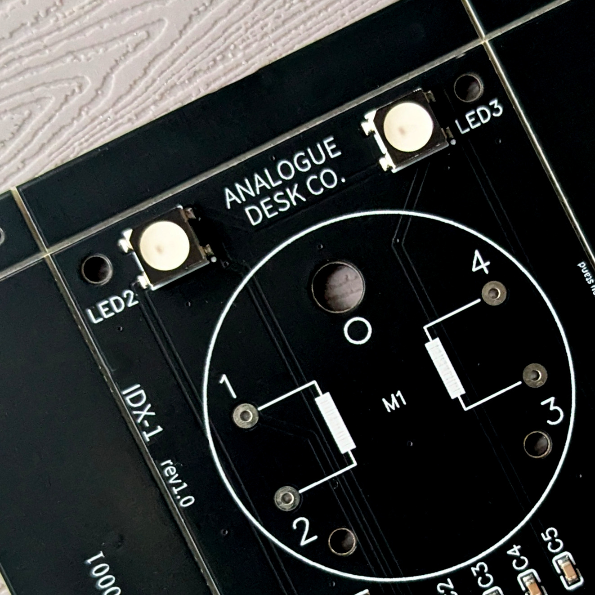

# IDX-1 / User Manual

**Model:** IDX-1  
**Batch:** 001  
**Date:** 2026-04-20

---

## 01 / THE CONCEPT
IDX-1 bridges the gap between the ephemeral nature of digital data and the tactile permanence of instrumentation. Whether tracking market volatility or environmental signals, you now have a physical anchor for your most important data.

We believe in open architecture.

---

## 02 / PRE-FLIGHT CHECK
Before powering the device for the first time, please note:

* **Power Input:** Use the provided USB-C cable. Connect to a standard 5V DC (0.5A) USB power source.
* **WiFi:** IDX-1 is designed for 2.4GHz WPA2 Home Networks. It is **not** compatible with 5GHz-only bands or Captive Portals.
* **Mechanical Care:** The needle is driven by a precision stepper motor. **Do not manually rotate the needle**, as this may cause misalignment or damage.
* **Safety:** Consult and retain the supplied safety information.

---

## 03 / SETUP WIFI
1.  **Power On:** Connect the USB-C cable. The device will glow **deep blue**, indicating it is ready for setup.
2.  **Access Point:** On your smartphone or laptop, connect to the WiFi network named `IDX-1_setup`.
3.  **Portal:** A configuration page should open automatically. If not, navigate to `http://192.168.4.1`.
4.  **Password:** Use `analoguedeskco`.
5.  **Credentials:** Select your home WiFi and enter your password.
6.  **IP Address:** Once connected, the device will display its local IP address. **Copy this address** for step 05.
7.  **Finish:** Press the button to begin initialisation.

---

## 04 / INITIALISATION
IDX-1 will cycle through several phases indicated by color:

* **WHITE (5s):** Reset mode (Factory reset can be triggered here).
* **LIGHT BLUE / CYAN:** Motor zeroing. The needle will sweep its full range; light buzzing is normal.
* **GREEN:** Centering. Pointer moves to midpoint.
* **ACTIVE:** The device enters operating mode (Default: Clock mode / Glacier ambience).

---

## 05 / CONFIGURATION
Access the internal dashboard via your web browser to customize your device.

1.  Paste the **IP Address** from Step 03 into your browser.
2.  Create a bookmark for future convenience.
3.  **Dashboard Sections:**
    * **MODE:** Select a data source.
    * **AMBIENCE:** Modify LED effects and night mode.
    * **ADVANCED:** Diagnostics and reset options.

---

## 06 / MODES & TRACKING
Choose what data IDX-1 references. Key modes include:

* **Air Quality Index (AQI):** Based on your city location.
* **Crypto (Fear & Greed / Price):** Options for Alt.me or CoinMarketCap (CMC API key required for CMC modes).
* **Clock:** 12 or 24-hour sweeps.
* **Home Assistant:** Displays any numeric entity state from your local instance.
* **Pomodoro:** Physical countdown timer.

### Tracking Styles
* **Relative:** The center represents zero change (e.g., Stocks/Crypto 24h trends).
* **Absolute:** Maps to a fixed 0–100 scale (e.g., AQI or Fear & Greed).
* **Focus:** Tangible sweep toward task completion.

---

## 07 / AMBIENCE
We recommend long **CYCLE DURATIONS** (e.g., 600 seconds) for maximum calm.

| Theme | Effect |
| :--- | :--- |
| **Static** | A single unchanging colour. |
| **Pulse** | Slowly undulating; like breathing. |
| **Glacial** | Breathless whites and ice blues. |
| **Aurora** | Electromagnetic storms of green and blue. |
| **Sunset** | Soothing end-of-day colours. |
| **Sentiment** | Red (left), White (center), Green (right). Best for market trackers. |

---

## 08 / ADVANCED & TROUBLESHOOTING
* **Pointer Calibration:** If misaligned, set Mode to "Off" and tweak by +/- 10°.
* **Timezone:** Adjust to ensure Night Mode operates correctly.
* **OTA Updates:** Firmware can be updated via the Advanced page (ElegantOTA).
* **Hardware Reset:** Cycle power 3 times, turning it off specifically during the **White** phase. The device will glow **Magenta** when reset is complete.

---

## 09 / CARE & MAINTENANCE
* **Cleaning:** Use only a dry microfibre cloth.
* **Warning:** **Do not use isopropyl alcohol or glass cleaners**, as they cause "crazing" in the acrylic.
* **Hardware:** Periodically check that M3 corner bolts are finger-tight.

---

## 10 / DEVELOPER SPECIFICATIONS
IDX-1 is built on an open architecture.

* **MCU:** ESP32-C3-MINI-1 (4MB Flash)
* **Motor:** X27.168 Stepper Motor
* **LEDs:** 4 x WS2812B
* **Interface:** USB-C Serial

### GPIO PIN MAPPING

| Component | Function | ESP32-C3 Pin |
| :--- | :--- | :--- |
| Stepper Motor | Coil A (1) | GPIO 00 |
| Stepper Motor | Coil A (2) | GPIO 01 |
| Stepper Motor | Coil B (1) | GPIO 06 |
| Stepper Motor | Coil B (2) | GPIO 07 |
| RGB LEDs | Data | GPIO 08 |
| Button | Reset | GPIO 09 |

### ESPHOME

IDX-1 supports [ESPHome](https://esphome.io) as an alternative firmware, giving full control to Home Assistant.

The ESPHome configuration files required to build the firmware binary are available at [github.com/analoguedeskco/esphome](https://github.com/analoguedeskco/esphome). Compile these using the ESPHome dashboard or CLI to produce a `.bin`, then flash via USB-C. The GPIO pin mapping above applies directly to the configuration.

Once flashed, IDX-1 appears as a native Home Assistant device — the needle and LEDs are exposed as standard entities and can be driven by any HA automation.

To switch back to the stock firmware, contact support (see below).

---
**Support:** 

support@analoguedesk.co