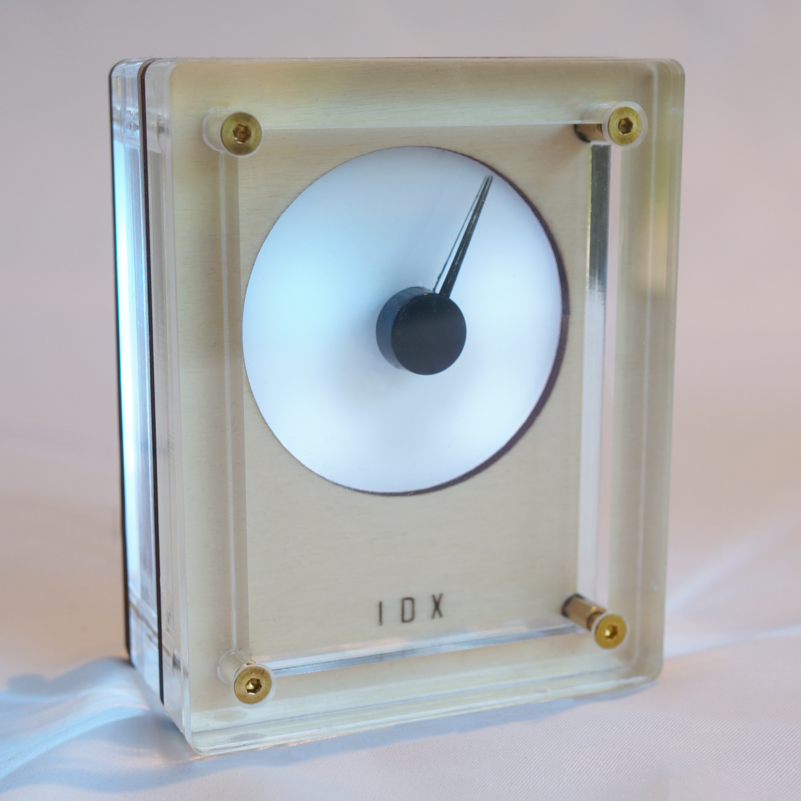

# IDX-2 / User Manual

**Model:** IDX-2  
**Date:** 2026-06-09

---

## 01 / THE CONCEPT

IDX-2 bridges the gap between the ephemeral nature of digital data and the tactile permanence of instrumentation. Whether tracking market volatility or environmental signals, you now have a physical anchor for your most important data.

We believe in open architecture.

---

## 02 / PRE-FLIGHT CHECK

Before powering the device for the first time, please note:

- **Power Input:** Use the provided USB-C cable. Connect to a standard 5V DC (0.5A) USB power source.
- **WiFi:** IDX-2 is designed for 2.4GHz WPA2 Home Networks. It is **not** compatible with 5GHz-only bands or Captive Portals.
- **Mechanical Care:** The needle is driven by a precision stepper motor. **Do not manually rotate the needle**, as this may cause misalignment or damage.
- **Safety:** Consult and retain the supplied safety information.

---

## 03 / SETUP WIFI

1. **Power On:** Connect the USB-C cable. The device will glow **deep blue**, indicating it is ready for setup.
2. **Access Point:** On your smartphone or laptop, connect to the WiFi network named `IDX-setup`.
3. **Portal:** A configuration page should open automatically. If not, navigate to `http://192.168.4.1`.
4. **Password:** Use `analoguedeskco` if challenged.
5. **Credentials:** Select your home WiFi and enter your password.
6. **IP Address:** Once connected, the device will display its local IP address. **Copy this address** for step 05.
7. **Finish:** Press the button to begin initialisation.

---

## 04 / INITIALISATION

IDX-2 will cycle through several phases indicated by color:

- **WHITE (5s):** Reset mode (Factory reset can be triggered here).
- **LIGHT BLUE / CYAN:** Motor zeroing. The needle will sweep its full range; light buzzing is normal.
- **GREEN:** Centering. Pointer moves to midpoint.
- **ACTIVE:** The device enters operating mode (Default: Clock mode / Glacier ambience).

---

## 05 / CONFIGURATION

Access the internal dashboard via your web browser to customize your device.

1. Paste the **IP Address** from Step 03 into your browser.
2. Create a bookmark for future convenience.
3. Dashboard Sections:
   - **QUICK START:** Several pre-configured pairs of mode and ambience.
   - **MODE:** Select a data source.
   - **AMBIENCE:** Modify LED effects and night mode.
   - **ADVANCED:** Diagnostics and reset options.

---

## 06 / MODE

Choose what data source IDX-2 references.

Each MODE provides a mapping from its value to a 0-1 range, which defines the position of the pointer. Default values are shown below.

| MODE                      | MIN VALUE | MID POINT | MAX VALUE | NOTES                                                                                                   |
| :------------------------ | :-------- | :-------- | :-------- | :------------------------------------------------------------------------------------------------------ |
| Air Quality Index         | 0         | 50        | 100       | Absolute AQI scale, based on your city location.                                                        |
| Alt.me Fear & Greed Index | 0         | 50        | 100       | Absolute sentiment index (0 = extreme fear, 100 = extreme greed).                                       |
| CMC Crypto Tracker        | -5%       | 0%        | +5%       | Relative 24h price change; centre is no change. CMC API key required.                                   |
| CMC Fear & Greed Index    | 0         | 50        | 100       | Absolute sentiment index. CMC API key required.                                                         |
| Clock (12h)               | 12.00     | 06.00     | 11.59     | Does not rotate like a clock; Sweeps through 180 degrees in 12h then returns to MIN                     |
| Clock (24h)               | 10.00     | 12.00     | 23.59     | Does not rotate like a clock; Sweeps through 180 degrees in 24h then returns to MIN                     |
| Finnhub Stock Tracker     | -5%       | 0%        | +5%       | Relative 24h price change; centre is no change.                                                         |
| Home Assistant            | 0         | 50        | 100       | Maps any numeric entity state from your local instance. For indoor temperature, choose range like 9-25C |
| Pomodoro Timer            | 0         | 12m30s    | 25m       | Focus sweep toward task completion (counts down). Minutes.                                              |
| Temperature               | -10C      | 15C       | 40C       | Maps a OpenMeteo temperature report for your city location.                                             |

### READING THE DIAL

Once you understand how it moves, the dial is easy to read.

Firstly, by default, the pointer moves 180 degrees from pointing left, to up, to right. The bottom half of the dial is not used.

The rotation of the pointer is defined by a `position` value between 0 (MIN) and 1 (MAX):

The table above shows each mode's mapping.

You can also go to ADVANCED / DIAGNOSTICS / EVENT LOG in the UI to see the real-time value generated by the current mode.

---

## 07 / AMBIENCE

We recommend long **CYCLE DURATIONS** (e.g., 600 seconds) for maximum calm.

| Theme         | Effect                                                                        |
| :------------ | :---------------------------------------------------------------------------- |
| **Static**    | A single unchanging colour of your choice.                                    |
| **Pulse**     | Slowly undulating; like breathing.                                            |
| **Glacial**   | Breathless whites and ice blues.                                              |
| **Aurora**    | Electromagnetic storms of green and blue.                                     |
| **Nebula**    | Deep space in blue and purple.                                                |
| **Sunset**    | Soothing end-of-day colours.                                                  |
| **Sentiment** | Red (left), Green (right). Best for market trackers. Colours can be adjusted. |
| **Alert**     | White, until a threshold is reached, then red                                 |

---

## 08 / ADVANCED & TROUBLESHOOTING

- **Pointer Calibration:** If misaligned, set Mode to "Off" and tweak by +/- 10° until pointing at 12 o'clock position.
- **Timezone:** Adjust to ensure Night Mode operates correctly.
- **OTA Updates:** Firmware can be updated via the Advanced page (ElegantOTA).
- **Hardware Reset:** Cycle power 3 times, turning it off specifically during the **White** phase. The device will glow **Magenta** when reset is complete. It will turn blue and be ready for Wifi configuration.

---

## 09 / CARE & MAINTENANCE

- **Cleaning:** Use only a dry microfibre cloth.
- **Warning:** **Do not use isopropyl alcohol or glass cleaners**, as they cause "crazing" in the acrylic.
- **Hardware:** Periodically check that M3 corner bolts are finger-tight. Do not overtighten.

---

## 10 / DEVELOPER SPECIFICATIONS

IDX-2 is built on an open architecture.

- **MCU:** ESP32-C3-MINI-1 (4MB Flash)
- **Motor:** X27.168 Stepper Motor
- **LEDs:** 6 x WS2812B
- **Interface:** USB-C Serial

### GPIO PIN MAPPING

| Component     | Function   | ESP32-C3 Pin |
| :------------ | :--------- | :----------- |
| Stepper Motor | Coil A (1) | GPIO 00      |
| Stepper Motor | Coil A (2) | GPIO 01      |
| Stepper Motor | Coil B (1) | GPIO 06      |
| Stepper Motor | Coil B (2) | GPIO 07      |
| RGB LEDs      | Data       | GPIO 08      |
| Button        | Reset      | GPIO 09      |

### ESPHOME

IDX-2 supports [ESPHome](https://esphome.io) as an alternative firmware, giving full control to Home Assistant.

The ESPHome configuration files required to build the firmware binary are available at [github.com/analoguedeskco/esphome](https://github.com/analoguedeskco/esphome). Compile these using the ESPHome dashboard or CLI to produce a `.bin`, then flash via [web.esphome.io](https://web.esphome.io/)

Once flashed, IDX-2 appears as a native Home Assistant device — the needle and LEDs are exposed as standard entities and can be driven by any HA automation.

To switch back to the stock firmware, contact support (see below).

---

**Support:**

<support@analoguedesk.co>
